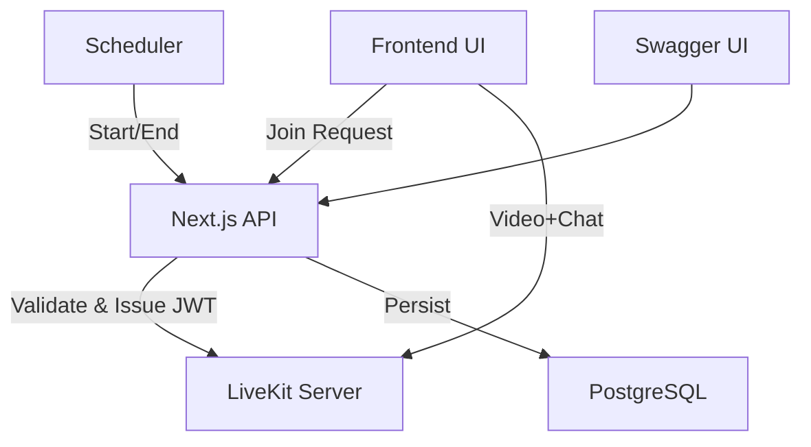

# 🧩 LiveKit Meet Next — Modular Build Specification

This document segments the LiveKit Meet Next system into well-defined **modules** for AI agent-based or human team development. Each module includes its **purpose**, **key responsibilities**, **core files**, **dependencies**, and **handoff outputs**.

---

## 1. 🧱 Core Modules Overview

| Module                            | Purpose                                            | Primary Language            | Responsible Agent |
| --------------------------------- | -------------------------------------------------- | --------------------------- | ----------------- |
| 1. Meeting Management             | Handles creation, scheduling, instant meetings     | TypeScript (API Routes)     | Backend Agent     |
| 2. Authentication & Token Service | Issues LiveKit JWTs and validates access           | TypeScript                  | Backend Agent     |
| 3. Participant Management         | Stores and validates participants                  | TypeScript                  | Backend Agent     |
| 4. Scheduler                      | Manages meeting lifecycle (start/end)              | Node/Serverless             | Backend Agent     |
| 5. LiveKit Integration            | Connects LiveKit SDKs (Server + Client)            | TypeScript                  | Backend Agent     |
| 6. Meeting UI                     | User interface for joining and hosting meetings    | React + Tailwind            | Frontend Agent    |
| 7. Chat & Collaboration           | Implements real-time chat and optional persistence | React + LiveKit DataChannel | Frontend Agent    |
| 8. Dashboard                      | Lists meetings, instant meeting launcher           | React + Next.js 15          | Frontend Agent    |
| 9. API Documentation              | Swagger / OpenAPI implementation                   | TypeScript                  | Backend Agent     |
| 10. Deployment & Infrastructure   | Docker, Env, Reverse Proxy setup                   | YAML / Shell                | DevOps Agent      |

---

## 2. 📆 Meeting Management Module

**Purpose:** Manage scheduled and instant meetings, including password enforcement and lifecycle states.

### Responsibilities

* CRUD operations for meetings.
* Password hashing with bcrypt.
* Generate unique `roomName` for each meeting.
* Create join links with embedded password.
* Distinguish between **public** and **private** meetings.
* Handle both scheduled and instant meetings.

### Key Files

```
src/app/api/meetings/route.ts
src/app/api/meetings/instant/route.ts
src/lib/prisma.ts
src/lib/utils.ts
```

### Implementation Tasks

1. Define Prisma models for `Meeting` and `Participant`.
2. Add validation schema using `zod`.
3. Implement POST `/api/meetings` (scheduled).
4. Implement POST `/api/meetings/instant` (instant creation).
5. Generate `joinUrl` and store meeting in DB.

### Output

* Meeting record in DB.
* Joinable URL for meeting.
* JSON API responses for integration.

---

## 3. 🔐 Authentication & Token Service

**Purpose:** Issue LiveKit JWTs for meeting access.

### Responsibilities

* Validate meeting password and participant email.
* Generate LiveKit token with proper permissions.
* Short-lived token TTL (15 min).

### Key Files

```
src/lib/livekit.ts
src/app/api/meetings/[id]/token/route.ts
```

### Implementation Tasks

1. Import `@livekit/server-sdk`.
2. Implement `createLiveKitToken()` utility.
3. Use `AccessToken` and `addGrant()` for permissions.
4. Verify password with bcrypt.compare().
5. Verify participant email for private meetings.

### Output

* Secure LiveKit join token.
* `roomName`, `livekitUrl` for frontend.

---

## 4. 👥 Participant Management Module

**Purpose:** Manage allowed participants for private meetings.

### Responsibilities

* Store emails in `Participant` table.
* Validate participant existence on join.
* Add/remove participants via API.

### Key Files

```
src/app/api/meetings/[id]/participants/route.ts
prisma/schema.prisma
```

### Implementation Tasks

1. Add participants array on meeting creation.
2. POST `/api/meetings/:id/participants` to update list.
3. On join, check `email` against list.

### Output

* Participant validation mechanism.

---

## 5. ⏰ Scheduler Module

**Purpose:** Automate meeting lifecycle transitions.

### Responsibilities

* Detect scheduled meetings to activate.
* Detect expired meetings to end.
* Delete LiveKit room on meeting end.

### Key Files

```
src/app/api/scheduler/route.ts
src/lib/scheduler.ts
```

### Implementation Tasks

1. Query meetings with `startTime <= now` & `status = SCHEDULED`.
2. Mark `ACTIVE` and broadcast.
3. Query meetings with `endTime <= now` & `status = ACTIVE`.
4. Mark `ENDED` and call `roomService.deleteRoom()`.

### Output

* Updated meeting statuses.
* Cleaned-up LiveKit rooms.

---

## 6. 📡 LiveKit Integration Module

**Purpose:** Provide unified abstraction for LiveKit APIs.

### Responsibilities

* Manage room lifecycle using `RoomServiceClient`.
* Issue join tokens via `AccessToken`.
* Serve LiveKit configuration to frontend.

### Key Files

```
src/lib/livekit.ts
.env
```

### Implementation Tasks

1. Configure `LIVEKIT_API_KEY`, `LIVEKIT_API_SECRET`, and `LIVEKIT_URL`.
2. Expose reusable functions:

   * `createRoom(roomName)`
   * `deleteRoom(roomName)`
   * `createLiveKitToken(identity, roomName, name)`
3. Handle LiveKit API errors gracefully.

### Output

* Token generation utility.
* Room management interface.

---

## 7. 🖥️ Meeting UI Module

**Purpose:** Provide in-browser video conference experience.

### Responsibilities

* Join meeting using token.
* Render video/audio/chat.
* Allow mute/unmute, screen share, leave.
* Show participants.

### Key Files

```
src/components/MeetingRoom.tsx
src/app/meetings/[room]/join/page.tsx
```

### Implementation Tasks

1. Implement Join form (email, name, password input).
2. Fetch token from `/api/meetings/:id/token`.
3. Render `<LiveKitRoom>` and `<VideoConference />`.
4. Integrate `ChatPanel`, `ParticipantList`, `ControlsBar`.

### Output

* Fully functional web meeting room.

---

## 8. 💬 Chat & Collaboration Module

**Purpose:** Enable in-room text chat.

### Responsibilities

* Real-time messaging over LiveKit DataChannel.
* Optional message persistence via API.

### Key Files

```
src/components/ChatPanel.tsx
src/app/api/messages/route.ts
```

### Implementation Tasks

1. Implement `useDataChannel()` hook.
2. Show messages with timestamps.
3. Optional POST `/api/messages` for persistence.

### Output

* Interactive chat system integrated with LiveKit.

---

## 9. 📊 Dashboard Module

**Purpose:** Display and manage meetings.

### Responsibilities

* List meetings (title, status, type, start, end).
* Provide actions to start instant meetings.
* Provide shareable join links.

### Key Files

```
src/app/meetings/page.tsx
src/components/MeetingTable.tsx
```

### Implementation Tasks

1. Fetch meetings from `/api/meetings`.
2. Render data table with filters.
3. Add buttons for **Schedule Meeting** and **Instant Meeting**.

### Output

* Interactive admin/host dashboard.

---

## 10. 🧾 API Documentation Module

**Purpose:** Provide human-readable & interactive API documentation.

### Responsibilities

* Serve Swagger UI.
* Maintain OpenAPI 3.1 JSON spec.

### Key Files

```
src/app/api/docs/route.ts
openapi.yaml / openapi.json
```

### Implementation Tasks

1. Implement `/api/docs` route.
2. Render Swagger UI using `swagger-ui-react`.
3. Keep OpenAPI spec synced with code.

### Output

* Live API documentation at `/api/docs`.

---

## 11. ⚙️ Deployment & Infrastructure Module

**Purpose:** Containerize and deploy system.

### Responsibilities

* Build Docker image.
* Configure environment variables.
* Setup reverse proxy and TLS.

### Key Files

```
Dockerfile
docker-compose.yml
.env.example
traefik.yml (optional)
```

### Implementation Tasks

1. Multi-stage Dockerfile for Next.js.
2. Include Prisma migrations in build.
3. Expose port 3000.
4. Optional: integrate with Traefik for SSL.

### Output

* Production container image.
* .env configuration template.

---

## 12. 🧠 Integration Flow Summary



---

## 13. ✅ Module Handoff Expectations

| Module              | Output                        | Depends On        |
| ------------------- | ----------------------------- | ----------------- |
| Meeting Management  | API endpoints & Prisma models | Database, Auth    |
| Auth & Token        | Token generation              | LiveKit Config    |
| Participants        | Validation system             | Meetings          |
| Scheduler           | Lifecycle automation          | Meetings, LiveKit |
| LiveKit Integration | Token/Room utilities          | None              |
| Meeting UI          | Join form + LiveKitRoom       | Token API         |
| Chat                | Chat UI + DataChannel logic   | LiveKit UI        |
| Dashboard           | Meeting list & instant launch | Meeting APIs      |
| Swagger Docs        | `/api/docs` UI                | All APIs          |
| Deployment          | Docker & Env setup            | All modules       |

---

**End of Modular Build Specification for AI Agent Construction**
